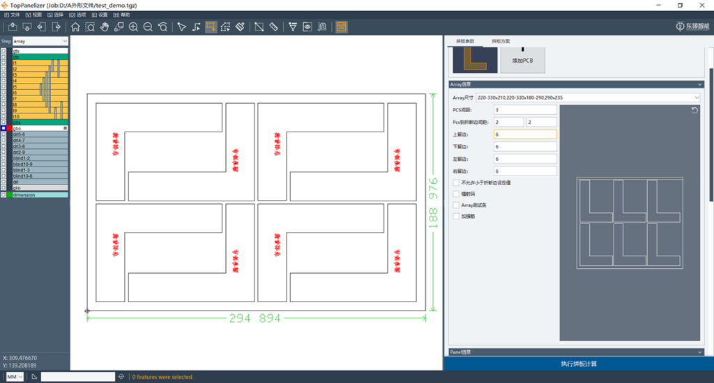
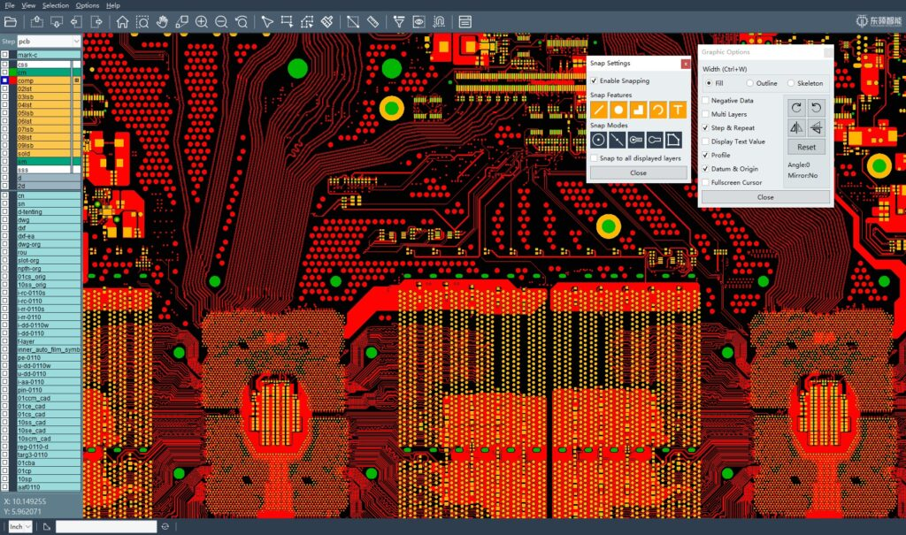

# a
## abc

1. A
2. B
3. C
4. D
5. f

# 兴达

1. First item
2. Second item
3. Third item
4. Fourth item

``Use `code` in your Markdown file.``

| 左对齐 | 右对齐 | 居中对齐 |
| :-----| ----: | :----: |
| 单元格 | 单元格 | 单元格 |
| 单元格 | 单元格 | 单元格 |

flow
st=>start: Start
op=>operation: Your Operation
cond=>condition: Yes or No?
e=>end
st->op->cond
cond(yes)->e
cond(no)->op

这是一个链接 [Markdown语法](https://markdown.com.cn/basic-syntax/)。

